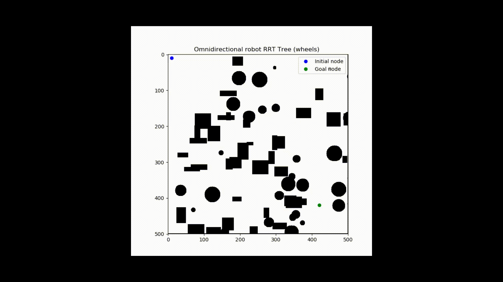
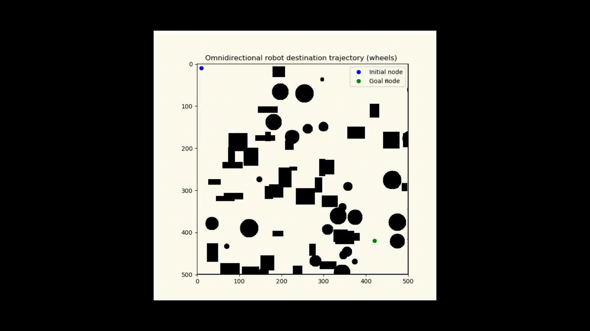
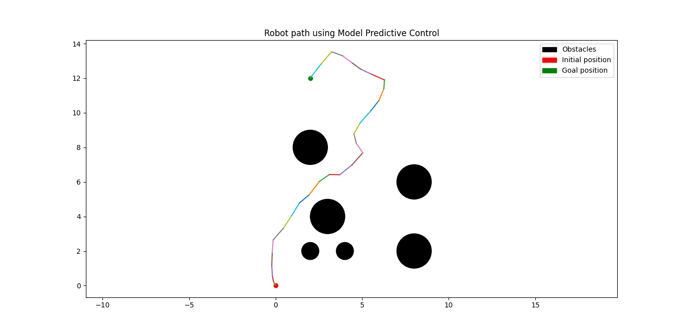
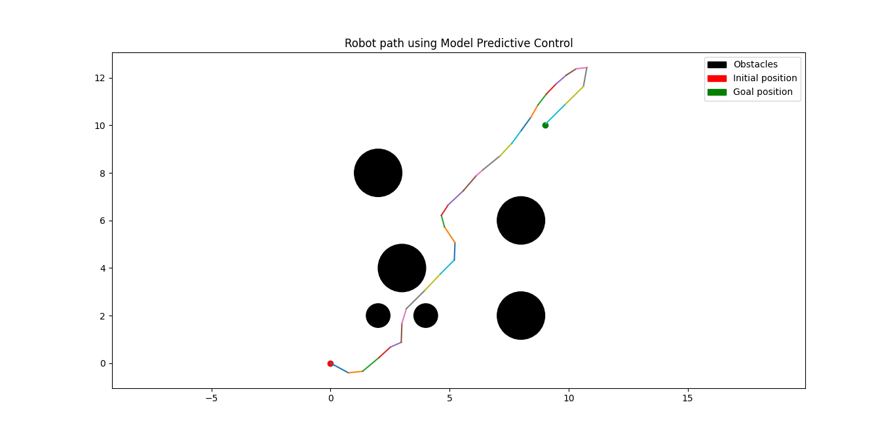
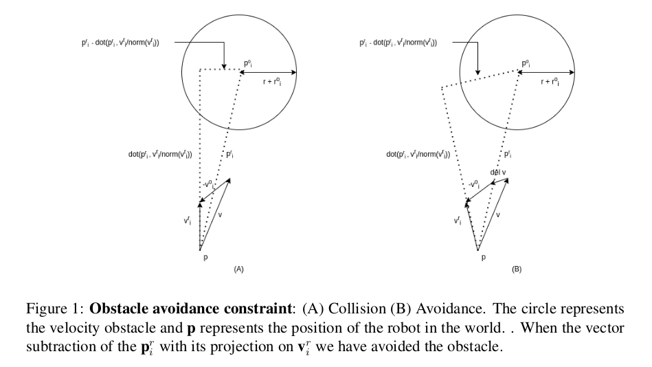
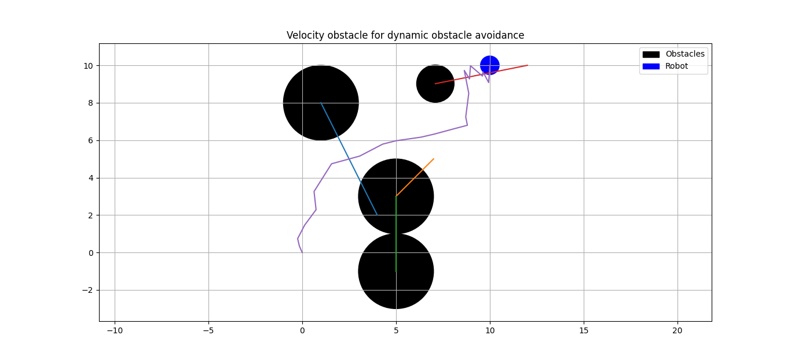

# Robotics-Planning-and-Navigation

This repository contains scripts for basic planning and navigation algorithms implemented using Python. Each directory has a report that details the implementation of the algorithm.

### Rapidly Exploring Random Trees

The robot has to navigate a two dimensional space, avoiding known locations with
obstacles, traveling from its initial location to a goal location. Implement the RRT
path planning algorithm for two cases, (1) Holonomic Robot and (2) Non-Holonomic
Robot. Assume localization information i.e., robot’s initial position, obstacle location,
goal location is given.

### Model Predictive Control

Model Predictive Control deals with determines a trajectory that a robot must follow in order
to reach its goal and avoid obstacles. This is formulated as an optimization problem wherein
we optimize for the velocities at each time step.

### Dynamic Collision Avoidance using collision cones

### Contributor

- Rahul Sajnani
